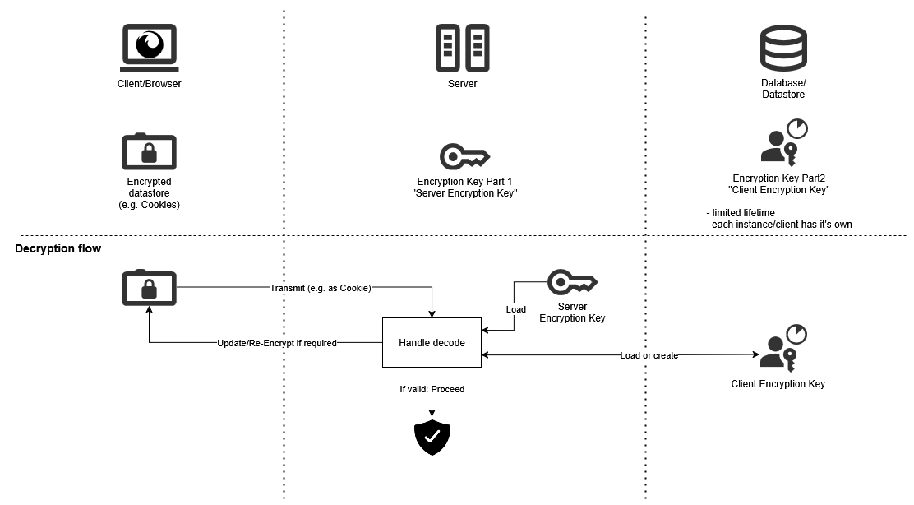

# OAuth2/OIDC Remember Me

Provides a persistent Remember Me mechanism for [OAuth2/OIDC](../oauth2-oidc/) to survive server restarts or work inside clustering environments.

> [!NOTE]
> Primarily designed for OIDC and E-Mails

<details><summary>Detailed explanation of why this exists</summary>

## The problem

When a client/user tries to migrate to another instance of the webapp, e.g.
* after it/the server was restarted
* after being redirected to another node inside the cluster

it no longer recognizes the session and with that all authentification data.

## Existing options

### Persisting the session

There are some approaches for persisting the [Session with Spring Boot](https://docs.spring.io/spring-session/reference/index.html), however they usually involve serializing and persisting the session.

There are some problems with that:
* The session needs to be serializable
* If using Java Serialization: [It's insecure and will always be](https://github.com/frohoff/ysoserial)
* When updating your app the session data might become incompatible (especially when using Java serialization) and migrating it might be extremely difficult
* The sessions can contain a ton of data (and that needs to be store somewhere on the backend)
* If the persistent data/backend is breached, an attacker can easily use this data to login in / steal personal information
* When restoring the session it might be necessary to invoke app-specific logic

> **⚠ IMPORTANT**<br/>
> Data that should survive restarts/instance-switches (like the contents of a shopping cart) must NOT be stored inside the session!<br/>
> Store them in a persistent database or something similar

### Remember-Me Authentication

Spring Boot provides [Remember-Me authentication](https://docs.spring.io/spring-security/reference/servlet/authentication/rememberme.html).

This is a lot better than using serializing the session, as it doesn't requires lots of serialization and data-storage.

However are still some problem with that:
* You need to revalidate if the client is still allowed to login
    * This means communicating with the OIDC server, to get relevant information
        * If the OIDC server is down you have a problem because you can't get the required data
* If the persistent data/backend is breached, an attacker can easily use this data to login in

## How is this improved here?

* If the persistent data/backend is breached, the data is useless for the attacker:
  * The data is stored on the client which the attacker cannot access easily
  * An attacker has to get both: The server encryption key (stored on server) and the client encryption keys (stored in database)
  * The encryption keys can easily be rotated (just create a new payload-encryption version, see example configuration below)
* Most logic after the deserialization is not needed; Re-Validation is only required if the client was not seen for a longer time

</details>

## How it works



For more detailed docs have a look at [the javadoc of ``OAuth2CookieRememberMeServices``](./src/main/java/software/xdev/sse/oauth2/rememberme/OAuth2CookieRememberMeServices.java).

## Requirements

* [CheckAuth + RefreshFilter from base module need to be enabled and configured](../oauth2-oidc/)

## Usage

* **You need to implement [``OAuth2RememberMeUserEnricher``](./src/main/java/software/xdev/sse/oauth2/rememberme/userenrichment/OAuth2RememberMeUserEnricher.java) and [``AuthRememberMeSecretService``](./src/main/java/software/xdev/sse/oauth2/rememberme/secrets/AuthRememberMeSecretService.java)**
* Inside your main ``WebSecurity#configure`` add:
    ```java
    this.cookieRememberMeServices.install(http);
    ```

## Example configuration

```yaml
sse:
  auth:
    remember-me:
      payload-encryption:
        standard: v2
        chacha20:
          v2:
            nonce: JustForDev_1
        aesgcm:
          legacy:
            init-vector: RandomInitIV
            secret-key-length: 16
```

## Additional information

* If you use clustering you should still use [Stick Sessions](https://kubernetes.github.io/ingress-nginx/examples/affinity/cookie/) for the HTTP-Session
    * Otherwise a lot of performance might get lost due to the decryption overhead
* The [size of a cookie is limited to ~4kB](https://datatracker.ietf.org/doc/html/rfc6265#section-6.1). If you have a ton of data inside the serialized authentication data (e.g. additional OIDC attributes) you might have to trim it down (instruct the OIDC server to send less) or customize the serialization to exclude it.
  * By default there are compression mechanism in place to try to keep the serialized data low (usually a cookie has around ~2kB). This includes
    * Using the bare minimum for JSON attribute-names
    * Using deflate to compress the created JSON
    * Using ChaCha20 as it's encryption causes no overhead
